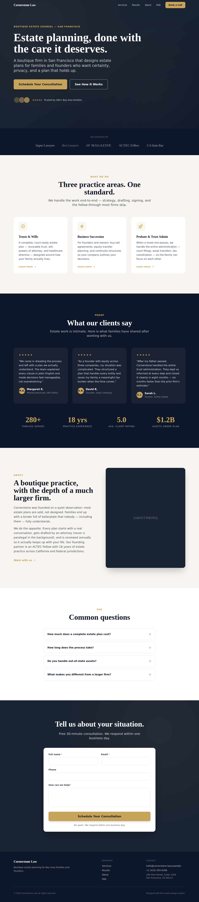

# web-design-pro

Repeatable pipeline for shipping 11/10 production-ready websites for any service industry. Combines two design skills — **ui-ux-pro-max** (strategy) and **huashu-design** (execution) — into a single scaffold-driven workflow.



> See `examples/cornerstone-law/` for the fully-rendered demo (open `index.html` in any browser). Mobile capture: `docs/screenshots/cornerstone-law-mobile.png`.

## What you get

```
web-design-pro/
├── README.md                     ← you are here
├── docs/
│   ├── SOP.md                    ← canonical 10-task pipeline
│   ├── CHECKLISTS.md             ← mobile, conversion, self-review, anti-patterns
│   └── CLI-SETUP.md              ← optional: install ui-ux-pro-max / vercel / gws
├── scripts/
│   └── new-project.sh            ← prompts → scaffolds a new project
├── templates/
│   ├── design-system/MASTER.md.template
│   ├── assets/brand-spec.md.template
│   ├── index.html.template       ← full landing page (Hero→Footer)
│   ├── main.js.template          ← GSAP entrance + ScrollTrigger
│   └── vercel.json
├── examples/
│   └── cornerstone-law/          ← fully rendered demo
└── projects/                     ← your generated sites land here
```

## Quick start

```bash
# Scaffold a new project (interactive prompts):
./scripts/new-project.sh acme-plumbing

# Or non-interactive with env vars:
BUSINESS_NAME="Acme Plumbing" \
INDUSTRY="local home services plumbing" \
VIBE="bold-modern" \
GOAL="call" \
VALUE_PROP="24/7 emergency plumbing across the Bay Area" \
PRIMARY_CTA="Call Now: (555) 123-4567" \
  ./scripts/new-project.sh acme-plumbing
```

This creates `projects/acme-plumbing/` with:

- `design-system/MASTER.md` — palette, type, effects, anti-patterns to avoid
- `assets/acme-plumbing-brand/brand-spec.md` — asset manifest
- `index.html` — production landing page with placeholders flagged `[CLIENT TO PROVIDE]`
- `main.js` — GSAP entrance + scroll animations
- `vercel.json` — static deploy config

## The four vibe presets

The scaffold ships with four hand-tuned design systems. Pick the one closest to the brand; refine `MASTER.md` afterwards.

| Vibe                | Best for                                | Palette                            | Type pairing                   |
| ------------------- | --------------------------------------- | ---------------------------------- | ------------------------------ |
| `premium-trust`     | Law, finance, estate planning           | Deep navy + warm gold              | Playfair Display + Inter       |
| `bold-modern`       | Agencies, SaaS, creative shops          | Near-black + electric orange       | Space Grotesk + Inter          |
| `calm-wellness`     | Therapy, coaching, dental, spa          | Sage green + warm sand             | Cormorant Garamond + Lato      |
| `energetic-fitness` | Gyms, athletic brands, energy drinks    | Black + hot pink                   | Anton + Inter                  |

When `ui-ux-pro-max`'s `search.py` is available, replace the preset with the CLI-generated palette. See `docs/CLI-SETUP.md`.

## Workflow (per project)

1. **Scaffold** — `./scripts/new-project.sh <slug>` answering prompts
2. **Collect brand assets** — drop logo/photos into `projects/<slug>/assets/<slug>-brand/`, update `brand-spec.md`
3. **Replace placeholders** — search `index.html` for `[CLIENT TO PROVIDE]` and fill with real copy
4. **Confirm direction** — show client `design-system/MASTER.md` + a screenshot of the hero before going deep
5. **Self-review** — run `docs/CHECKLISTS.md` top to bottom
6. **Deploy** — `cd projects/<slug> && vercel --yes` (requires Vercel CLI)
7. **Validate** — screenshot at 390px (iPhone) and 1280px (desktop), verify no horizontal scroll, no console errors

## Why this exists

AI-generated websites have a tell — purple gradients, emoji icons, lorem ipsum, five primary CTAs, generic stock photos. This pipeline enforces the opposite at every stage:

- **Design first, code second** — `MASTER.md` is committed before any HTML is written
- **Real assets only** — `brand-spec.md` blocks the build until logo/colors are collected or explicitly inferred
- **One primary CTA** — templates enforce a single accent color, used sparingly
- **Mobile-first** — every template targets 390px first, scales up
- **No animation slop** — GSAP fires on 4 hero elements + section reveals; everything else uses CSS hover transitions

See `docs/CHECKLISTS.md` → **Anti-pattern reference** for the full list.

## Status of CLI integrations

The SOP references three external CLIs. They are **optional** — this scaffold works without them.

| CLI                | What it does                            | Required? | Setup                  |
| ------------------ | --------------------------------------- | --------- | ---------------------- |
| `ui-ux-pro-max`    | Data-driven palette + type pairing      | No        | `docs/CLI-SETUP.md`    |
| `vercel`           | Static deploy                           | For deploy only | `npm i -g vercel`     |
| `gws gmail`        | Send live URLs by email                 | No        | Internal Google tool   |

When unavailable, fall back to the vibe presets, `npx serve` for local preview, and a manually-composed handoff email.
